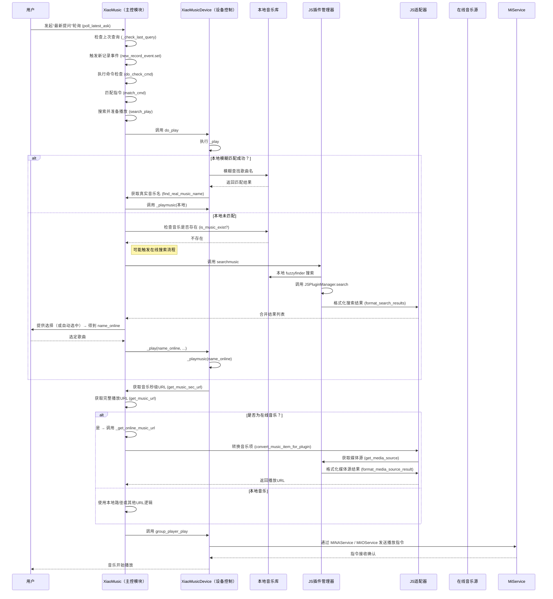

好的，我们来梳理一下在线音乐搜索和播放的实现机制及调用流程。

## 在线音乐搜索与播放实现机制

### 核心组件

1.  **[XiaoMusic.searchmusic](file://C:\dev\boluofan\xiaomusic-online\xiaomusic\xiaomusic.py#L1523-L1547)**: 主搜索入口，融合本地和在线搜索结果。
2.  **[JSPluginManager](file://C:\dev\boluofan\xiaomusic-online\xiaomusic\js_plugin_manager.py#L18-L528)**: 管理和调用 JavaScript 插件，执行在线搜索和获取播放链接。
3.  **[JSAdapter](file://C:\dev\boluofan\xiaomusic-online\xiaomusic\js_adapter.py#L11-L216)**: 在 Python 代码和 JS 插件之间进行数据格式转换。
4.  **[XiaoMusic._get_online_music_url](file://C:\dev\boluofan\xiaomusic-online\xiaomusic\xiaomusic.py#L621-L662)**: 获取在线音乐的实际播放链接。
5.  **`XiaoMusic.all_music`**: 存储所有音乐（包括在线音乐）的元数据，其中在线音乐条目包含 `source: 'online'` 标记。

### 调用流程

以下是用户发出“搜索播放周杰伦”这类指令后的典型调用流程：

**详细步骤分解**:

1.  **语音指令接收**: `XiaoMusic.poll_latest_ask` 持续监听音箱指令，收到后通过 `XiaoMusic._check_last_query` 触发 `XiaoMusic.new_record_event`。
2.  **指令解析**: `XiaoMusic.do_check_cmd` 和 `XiaoMusic.match_cmd` 识别出是 `search_play` 指令。
3.  **初始播放请求**: `XiaoMusic.search_play` 调用 `XiaoMusic.do_play(..., exact=False)`。
4.  **设备处理**: `XiaoMusicDevice.play` 调用 `XiaoMusicDevice._play`。
5.  **模糊匹配**:
    *   `XiaoMusicDevice._play` 调用 `XiaoMusic.find_real_music_name(name, n=config.search_music_count)`。
    *   `XiaoMusic.find_real_music_name` 主要在现有的 `XiaoMusic.all_music` keys (即本地歌曲名) 中进行模糊匹配。
    *   如果匹配到本地歌曲，则直接播放。
6.  **在线搜索触发 (隐式)**:
    *   如果 `find_real_music_name` 未在本地找到足够匹配项，或者后续流程发现 `name` 并非一个已知的有效歌曲名（例如，它只是一个搜索关键词）。
    *   **关键点**: 真正的在线搜索通常发生在用户通过 Web UI 输入关键词点击搜索，或者语音指令被解析为需要主动调用搜索功能时。此时会调用 [XiaoMusic.searchmusic(name)](file://C:\dev\boluofan\xiaomusic-online\xiaomusic\xiaomusic.py#L1523-L1547)。
    *   [XiaoMusic.searchmusic](file://C:\dev\boluofan\xiaomusic-online\xiaomusic\xiaomusic.py#L1523-L1547):
        *   首先调用 [fuzzyfinder](file://C:\dev\boluofan\xiaomusic-online\xiaomusic\utils.py#L116-L119) 在本地歌曲中搜索。
        *   然后调用 [XiaoMusic._search_online_music(name)](file://C:\dev\boluofan\xiaomusic-online\xiaomusic\xiaomusic.py#L1549-L1571)。
        *   [XiaoMusic._search_online_music](file://C:\dev\boluofan\xiaomusic-online\xiaomusic\xiaomusic.py#L1549-L1571) 遍历启用的插件 ([JSPluginManager.get_enabled_plugins](file://C:\dev\boluofan\xiaomusic-online\xiaomusic\js_plugin_manager.py#L272-L277))，对每个插件调用 [JSPluginManager.search(plugin_name, name)](file://C:\dev\boluofan\xiaomusic-online\xiaomusic\js_plugin_manager.py#L279-L322)。
        *   搜索结果通过 [JSAdapter.format_search_results](file://C:\dev\boluofan\xiaomusic-online\xiaomusic\js_adapter.py#L18-L47) 格式化，使其符合 [XiaoMusic](file://C:\dev\boluofan\xiaomusic-online\xiaomusic\xiaomusic.py#L72-L1713) 内部使用的结构（通常是歌曲名列表，这些名字会被添加到 `XiaoMusic.all_music` 中，并标记为在线音乐）。
        *   本地和在线结果合并后返回。
7.  **播放准备**: 假设通过某种方式（如 UI 选择或默认选取）得到了一个确定的在线歌曲名 `name_online`。[XiaoMusicDevice._play](file://C:\dev\boluofan\xiaomusic-online\xiaomusic\xiaomusic.py#L1803-L1844) 或 [XiaoMusicDevice._playmusic](file://C:\dev\boluofan\xiaomusic-online\xiaomusic\xiaomusic.py#L1931-L1972) 被调用。
8.  **URL 获取**:
    *   [XiaoMusicDevice._playmusic](file://C:\dev\boluofan\xiaomusic-online\xiaomusic\xiaomusic.py#L1931-L1972) 调用 [XiaoMusic.get_music_sec_url(name_online)](file://C:\dev\boluofan\xiaomusic-online\xiaomusic\xiaomusic.py#L550-L576)。
    *   [XiaoMusic.get_music_sec_url](file://C:\dev\boluofan\xiaomusic-online\xiaomusic\xiaomusic.py#L550-L576) 调用 [XiaoMusic.get_music_url(name_online)](file://C:\dev\boluofan\xiaomusic-online\xiaomusic\xiaomusic.py#L602-L614)。
    *   [XiaoMusic.get_music_url](file://C:\dev\boluofan\xiaomusic-online\xiaomusic\xiaomusic.py#L602-L614) 检查 [XiaoMusic.is_online_music(name_online)](file://C:\dev\boluofan\xiaomusic-online\xiaomusic\xiaomusic.py#L616-L619)。由于 `name_online` 是在线歌曲，此检查返回 `True`。
    *   因此，调用 [XiaoMusic._get_online_music_url(name_online)](file://C:\dev\boluofan\xiaomusic-online\xiaomusic\xiaomusic.py#L621-L662)。
9.  **在线 URL 获取**:
    *   [XiaoMusic._get_online_music_url](file://C:\dev\boluofan\xiaomusic-online\xiaomusic\xiaomusic.py#L621-L662) 从 `XiaoMusic.all_music[name_online]` 中取出预存的 `plugin_name` 和 `original_data`。
    *   使用 [JSAdapter.convert_music_item_for_plugin](file://C:\dev\boluofan\xiaomusic-online\xiaomusic\js_adapter.py#L197-L216) 将这些数据转换为插件期望的格式。
    *   调用 [JSPluginManager.get_media_source(plugin_name, converted_item)](file://C:\dev\boluofan\xiaomusic-online\xiaomusic\js_plugin_manager.py#L324-L342)。这会执行插件内的相应函数来获取播放链接。
    *   结果通过 [JSAdapter.format_media_source_result](file://C:\dev\boluofan\xiaomusic-online\xiaomusic\js_adapter.py#L49-L60) 格式化，提取出实际的 URL。
10. **发送播放指令**: 获取到 URL 后，[XiaoMusicDevice._playmusic](file://C:\dev\boluofan\xiaomusic-online\xiaomusic\xiaomusic.py#L1931-L1972) 调用 [XiaoMusicDevice.group_player_play(url)](file://C:\dev\boluofan\xiaomusic-online\xiaomusic\xiaomusic.py#L2193-L2200)，最终通过 `MiNAService` 或 `MiIOService` 将 URL 发送给对应的小爱音箱设备进行播放。

这个流程展示了如何将本地音乐和通过插件接入的在线音乐源统一管理，并在需要时动态获取播放链接，从而实现无缝的音乐播放体验。
