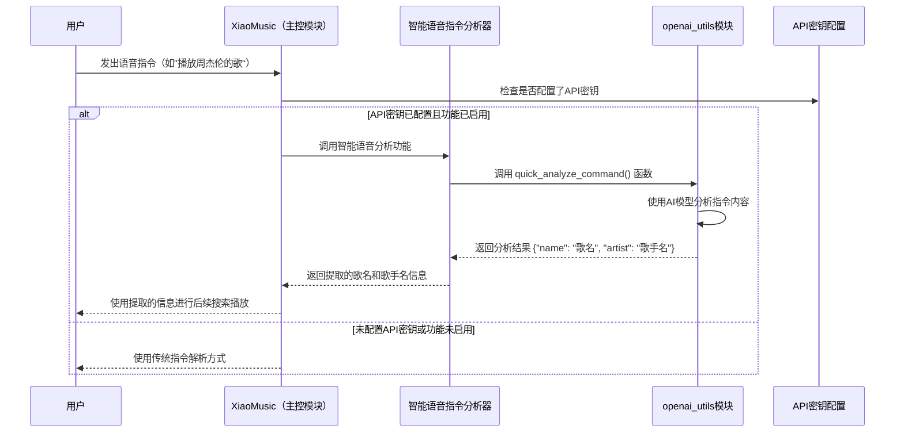
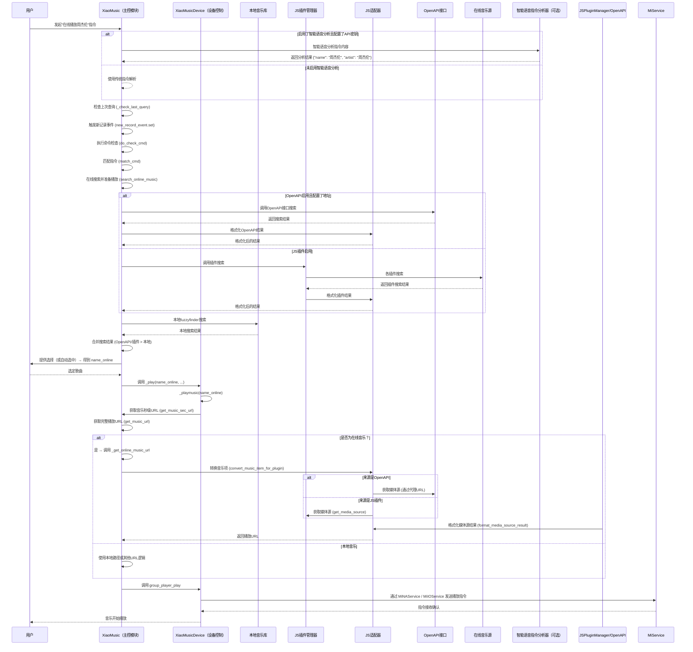
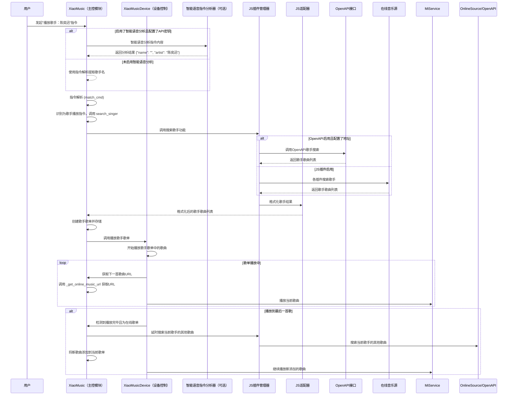
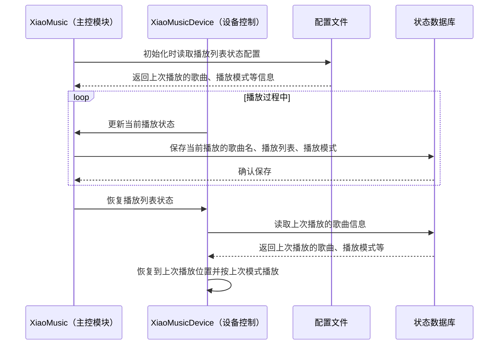

# XiaoMusic-Online 业务流程图

## 在线音乐搜索与播放实现机制

### 核心组件

1. **[XiaoMusic.searchmusic](file://C:\dev\boluofan\xiaomusic-online\xiaomusic\xiaomusic.py#L1523-L1547)**: 主搜索入口，融合本地、OpenAPI接口和JS插件搜索结果
2. **[JSPluginManager](file://C:\dev\boluofan\xiaomusic-online\xiaomusic\js_plugin_manager.py#L18-L528)**: 管理和调用 JavaScript 插件，执行在线搜索和获取播放链接
3. **[JSAdapter](file://C:\dev\boluofan\xiaomusic-online\xiaomusic\js_adapter.py#L11-L216)**: 在 Python 代码和 JS 插件之间进行数据格式转换
4. **[XiaoMusic._get_online_music_url](file://C:\dev\boluofan\xiaomusic-online\xiaomusic\xiaomusic.py#L621-L662)**: 获取在线音乐的实际播放链接
5. **`XiaoMusic.all_music`**: 存储所有音乐（包括在线音乐）的元数据，其中在线音乐条目包含 `source: 'online'` 标记
6. **OpenAPI接口**: 支持通过外部API获取音乐数据
7. **智能语音指令分析（可选）**: 使用AI技术分析用户语音指令（需用户配置API密钥），自动提取歌曲名和歌手名

### 调用流程 - 智能语音指令分析（可选功能）

以下是用户发出语音指令后，如果启用了智能语音分析功能的流程：

### 调用流程 - 普通在线搜索播放

以下是用户发出"在线播放周杰伦"这类指令后的典型调用流程：

### 调用流程 - 歌手播放功能

以下是用户发出"播放歌手：陈奕迅"这类指令后的调用流程：

### 调用流程 - 播放状态记忆功能

以下是记录和恢复播放列表状态的流程：

**详细步骤分解**:

1. **语音指令接收**: `XiaoMusic.poll_latest_ask` 持续监听音箱指令，收到后通过 `XiaoMusic._check_last_query` 触发 `XiaoMusic.new_record_event`

2. **智能语音指令分析（可选）**: 如果用户已配置API密钥并启用了此功能，在接收到语音指令后，通过智能语音指令分析器([openai_utils.quick_analyze_command](file://C:\dev\boluofan\xiaomusic-online\xiaomusic\openai_utils.py#L108-L118))自动提取歌曲名和歌手名信息。这个功能使用AI技术分析用户语音指令（需用户配置API密钥），自动识别并提取歌名、歌手名等关键信息。此功能默认不启用，需要用户自行配置API密钥后方可使用。

3. **指令解析**: `XiaoMusic.do_check_cmd` 和 `XiaoMusic.match_cmd` 识别出是 `search_play` 或 `search_singer` 指令，使用智能分析提取的参数（如果功能已启用）或传统解析的参数

4. **在线搜索触发**:
    - [XiaoMusic.searchmusic](file://C:\dev\boluofan\xiaomusic-online\xiaomusic\xiaomusic.py#L1523-L1547) 或 `search_singer`:
        - 首先检查是否启用了 OpenAPI 接口，如果启用则优先调用
        - 然后调用 [fuzzyfinder](file://C:\dev\boluofan\xiaomusic-online\xiaomusic\utils.py#L116-L119) 在本地歌曲中搜索
        - 再调用 [XiaoMusic._search_online_music(name)](file://C:\dev\boluofan\xiaomusic-online\xiaomusic\xiaomusic.py#L1549-L1571)
        - [XiaoMusic._search_online_music](file://C:\dev\boluofan\xiaomusic-online\xiaomusic\xiaomusic.py#L1549-L1571) 遍历启用的插件 ([JSPluginManager.get_enabled_plugins](file://C:\dev\boluofan\xiaomusic-online\xiaomusic\js_plugin_manager.py#L272-L277))，对每个插件调用 [JSPluginManager.search(plugin_name, name)](file://C:\dev\boluofan\xiaomusic-online\xiaomusic\js_plugin_manager.py#L279-L322)
        - 搜索结果通过 [JSAdapter.format_search_results](file://C:\dev\boluofan\xiaomusic-online\xiaomusic\js_adapter.py#L18-L47) 格式化，使其符合 [XiaoMusic](file://C:\dev\boluofan\xiaomusic-online\xiaomusic\xiaomusic.py#L72-L1713) 内部使用的结构（通常是歌曲名列表，这些名字会被添加到 `XiaoMusic.all_music` 中，并标记为在线音乐）
        - 本地、OpenAPI和在线结果合并后返回

5. **歌手播放功能**:
    - 用户调用"播放歌手：歌手名"指令时，会触发专门的歌手搜索功能
    - 通过 JS 插件或 OpenAPI 接口搜索该歌手的歌曲列表
    - 将搜索结果创建为临时歌单并开始播放

6. **URL 获取**:
    - [XiaoMusic.get_music_sec_url](file://C:\dev\boluofan\xiaomusic-online\xiaomusic\xiaomusic.py#L550-L576) 调用 [XiaoMusic.get_music_url(name_online)](file://C:\dev\boluofan\xiaomusic-online\xiaomusic\xiaomusic.py#L602-L614)
    - [XiaoMusic.get_music_url](file://C:\dev\boluofan\xiaomusic-online\xiaomusic\xiaomusic.py#L602-L614) 检查 [XiaoMusic.is_online_music(name_online)](file://C:\dev\boluofan\xiaomusic-online\xiaomusic\xiaomusic.py#L616-L619)。由于 `name_online` 是在线歌曲，此检查返回 `True`
    - 因此，调用 [XiaoMusic._get_online_music_url(name_online)](file://C:\dev\boluofan\xiaomusic-online\xiaomusic\xiaomusic.py#L621-L662)

7. **在线 URL 获取**:
    - [XiaoMusic._get_online_music_url](file://C:\dev\boluofan\xiaomusic-online\xiaomusic\xiaomusic.py#L621-L662) 从 `XiaoMusic.all_music[name_online]` 中取出预存的 `plugin_name`、`openapi_info` 或 `original_data`
    - 使用 [JSAdapter.convert_music_item_for_plugin](file://C:\dev\boluofan\xiaomusic-online\xiaomusic\js_adapter.py#L197-L216) 将这些数据转换为插件或OpenAPI期望的格式
    - 根据来源调用 [JSPluginManager.get_media_source(plugin_name, converted_item)](file://C:\dev\boluofan\xiaomusic-online\xiaomusic\js_plugin_manager.py#L324-L342) 或 OpenAPI 接口
    - 结果通过 [JSAdapter.format_media_source_result](file://C:\dev\boluofan\xiaomusic-online\xiaomusic\js_adapter.py#L49-L60) 格式化，提取出实际的 URL

8. **歌手续播功能**:
    - 当播放到歌单最后一首歌曲时，系统会检测是否为在线歌单
    - 如果是，会以延时方式搜索当前歌曲歌手的其他歌曲
    - 将新歌曲添加到当前播放列表并继续播放

9. **播放状态记录**:
    - 系统会记录每个播放列表的上次播放歌曲、播放模式等状态
    - 支持随机播放、全部循环、单曲循环等模式的状态持久化
    - 重启后可恢复到上次的播放状态

10. **解决用户指令识别不准确问题**:
    - 通过可选的智能语音指令分析功能，用户可以配置API密钥来提升语音指令识别的准确性
    - 此功能是可选的，默认不启用，解决了之前TODO中提到的用户指令识别不准确的痛点

这个流程展示了系统如何结合可选的智能语音指令分析（需用户配置API密钥）和多种音乐源（本地、OpenAPI接口、JS插件）进行统一管理，使用AI技术分析用户语音指令自动提取歌名、歌手名等关键信息（如果启用），再动态获取播放链接，同时支持歌手播放、歌手续播、播放状态记忆等高级功能，从而实现无缝的音乐播放体验。